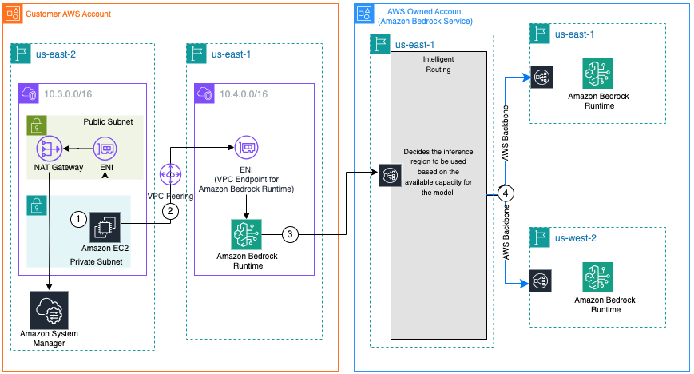
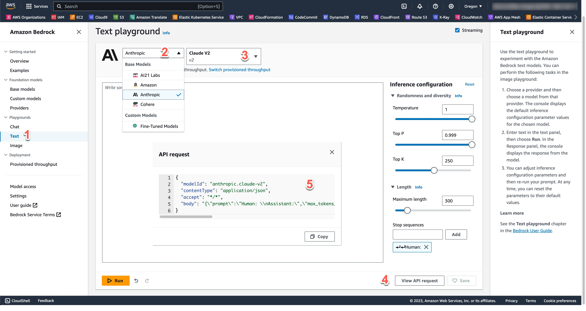
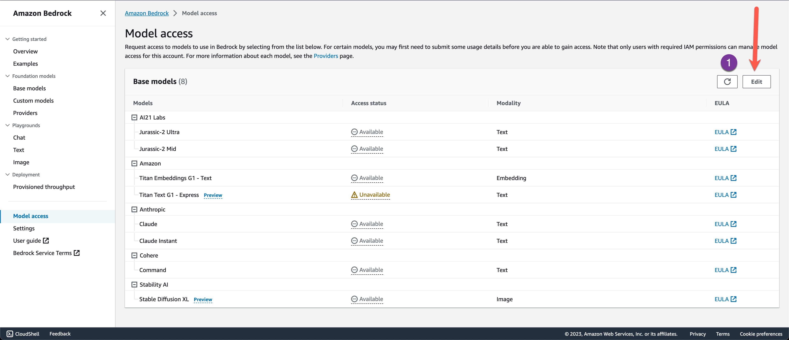
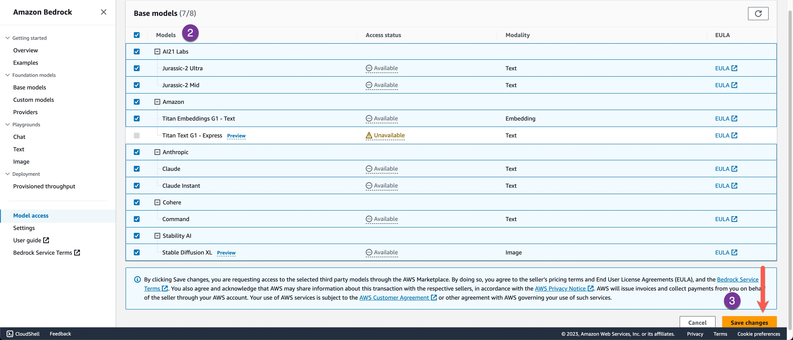

## Amazon Bedrock cross-region inference using private connectivity to Amazon Bedrock in one region.

Amazon Bedrock is a fully managed service that offers a choice of high-performing foundation models (FMs) from leading AI companies like AI21 Labs, Anthropic, Cohere, Meta, Stability AI, and Amazon via a single API. It also provides broad set of capabilities you need to build generative AI applications, simplifying development while maintaining privacy and security. Since Amazon Bedrock is serverless, you don't have to manage any infrastructure, and you can securely integrate and deploy generative AI capabilities into your applications using the AWS services you are already familiar with.

As of September, 28 2023 AWS Bedrock is Generally Available [Press Release: https://www.aboutamazon.com/news/aws/aws-amazon-bedrock-general-availability-generative-ai-innovations]

Previously, users might have to engineer their applications to handle scenarios involving traffic spikes that can use service quotas from multiple regions by implementing complex techniques such as client-side load balancing between AWS regions, where Amazon Bedrock service is supported. However, this dynamic nature of demand is difficult to predict, increases operational overhead, introduces potential points of failure, and might hinder businesses from achieving continuous service availability.

In August 2024, AWS announced the general availability of cross-region inference, a powerful feature allowing automatic cross-region inference routing for requests coming to Amazon Bedrock. This offers developers using on-demand inference mode, a seamless solution for getting higher throughput and performance, while managing incoming traffic spikes of applications powered by Amazon Bedrock. [Blog: https://aws.amazon.com/blogs/machine-learning/getting-started-with-cross-region-inference-in-amazon-bedrock/]

This workshop detail mechanisms customers can use to consume AWS Bedrock service. Namely:
1. Integrating and connecting with the Amazon Bedrock service: You will learn how to establish a secure VPC peering connection between two AWS region, enabling private communication and resource sharing while maintaining network isolation.
2. Invoking various models offered by Amazon Bedrock: Using the converse API and other techniques, you will learn how to invoke Amazon Bedrock's foundation models hosted in a different AWS region, demonstrating cross-region private connectivity.
3. Use In-built cross-region inference capability: Using cross-region inference capability in Amazon Bedrock, you will learn how to increase the throughput by utilizing compute across different AWS Regions to manage unplanned traffic bursts.



	1. The user establishes a session using an SSM agent running on Amazon EC2 in the source VPC with CIDR 10.3.0.0/16, located in the us-east-2 region.
	2. The user executes the invoke.py script, which calls the Amazon Bedrock Runtime API using the model inference profile. It uses a VPC endpoint for Amazon Bedrock Runtime, thus establishing a secure connection.
	3. The request reaches the intelligent routing system in the AWS-owned Bedrock service account. It routes the request to the appropriate region for inference based on model capacity availability.
	4. The LLM hosted in the inference region generates the response, which is sent back to the user. All data transfer between regions uses the AWS backbone network, resulting in secure and reliable communication.


## Workshop Overview
This workshop provides hands-on experience and Python code snippets to consume Foundational Models available in AWS Bedrock. "prompt.txt" file contains necessary model configurations to invoke FMs in Amazon Bedrock. Below is one such sample for Anthropic Claude Sonnet 3.5 Model invocation.

```JSON
{
        "prompt": "\n\nHuman: What is square root of 16? Provide step by step explaination\n\nAssistant:", 
        "max_tokens_to_sample":300,
        "stop_sequences":["\n\nHuman:","\n\nAssistant"],
        "temperature":1,
        "top_p":0.9,
        "top_k":250,
        "anthropic_version":"bedrock-2023-05-31"
}
```

<details>
  
<summary>How to find prompt configuration for various models</summary>

### Bedrock API Request

Visit the Amazon Bedrock Service page and follow the numbered sequence shown in the screenshot below.


  
</details>

## Prerequisites

1. Ensure Foundational Models are enabled in Amazon Bedrock

   <details>
  
   <summary>How to enable foundational models</summary>

   ### Model Access

   Visit the Amazon Bedrock Service page and follow the numbered sequence as shown in the screenshot below.

   

   
  
   </details>

2. Create Private VPC Endpoints for Bedrock Access to test Private Acccess [Refer: https://docs.aws.amazon.com/bedrock/latest/userguide/vpc-interface-endpoints.html]

   Note: You can control access to VPCe by updating the resource policy to specific Principal and Resources. 

3. Create VPC Peering Connection to test cross region access through VPC EndPoints [Refer: https://repost.aws/knowledge-center/vpc-peering-connection-create]

   Note: This workshop uses VPC Peering, however, same can be achieved through Transit Gateway setup that overcomes some of VPC Peering Limitations. [Refer: https://docs.aws.amazon.com/whitepapers/latest/building-scalable-secure-multi-vpc-network-infrastructure/vpc-to-vpc-connectivity.html]


> [!NOTE]
> If your dev environment is in PrivateSubnet make sure to have NAT setup appropriately to access Bedrock Service when not using VPC Endpoints [Refer: https://docs.aws.amazon.com/appstream2/latest/developerguide/managing-network-internet-NAT-gateway.html]

## Python Prerequisites

Please ensure you have below libraries installed for tool to work successfully in your development environment

```text
pip install cryptography
pip install boto3
pip install botocore
pip install pytz
```

## Executing Workshop

Download contents of the workshop in your Cloud9 development environment. Prior to executing the .py files, lets analyze the configuration files that drive various integrations to AWS Bedrock. 

```ini
[default]
UseVPCe = true
GetCredentialsFrom = 0
Region = us-east-1
AccessKey = <access-key>
SecretKey = <secret-key>
AssumeRoleARN = <iam-role-arn>
VPCEndpointURL = <VPCEndpointURL>
PromptFilePath = <prompt-file-name>
Debug = <true/false>

[models]
claude-35-sonnet = us.anthropic.claude-3-5-sonnet-20241022-v2:0
claude-3-opus = us.anthropic.claude-3-opus-20240229-v1:0
claude-3-sonnet = us.anthropic.claude-3-sonnet-20240229-v1:0
claude-3-haiku = us.anthropic.claude-3-haiku-20240307-v1:0
llama-31-70b-instruct = us.meta.llama3-1-70b-instruct-v1:0
llama-31-8b-instruct = us.meta.llama3-1-8b-instruct-v1:0
```

* UseVPCe - Accepts <true/false> as values and defines if application should connect to Bedrock via VPC EndPoint or through public bedrock endpoint [https://bedrock-runtime.<Region>.amazonaws.com](https://docs.aws.amazon.com/bedrock/latest/userguide/vpc-interface-endpoints.html).
* GetCredentialsFrom - defines where application should fetch credentials from to connect with Bedrock. Valid values are <0>
        0 - defines system should use the EC2 Instance Role credentials (assuming role assigned to EC2 environment has access to bedrock)
  [!NOTE] In the future, this workshop can be extended to cross-account cross-region setup and additional options will be provided for GetCredentialsFrom

> [!NOTE]
> Use of IAM Access/Secret Keys are discouraged since that open a security risk considering they are long lived tokens. Ideally, developers should use AWS SSO cli to fetch temporary credentials to connect with AWS Services from outside AWS. [Refer: https://docs.aws.amazon.com/cli/latest/userguide/sso-configure-profile-token.html]. This workshop do provide ability to provide Access/Secret keys to unblock users to gaining hands-on experince in case AWS SSO is not setup or user do not have any other means of gaining temporary credentials.

* AssumeRoleARN - IAM Role ARN for the role that has access to Amazon Bedrock, keep it as is for this workshop.
* VPCEndpointURL - VPC Endpoint URL [Example: https://vpce-xxxxxxx-xxxxx.bedrock-runtime.us-west-2.vpce.amazonaws.com](https://docs.aws.amazon.com/bedrock/latest/userguide/vpc-interface-endpoints.html)
* PromptFilePath - Path to file containing prompt structure
* Debug - Enables logging. Accepted values <true/false>
* [models] - This section contains the list of models the user can invoke on Bedrock. The user can make updates to this list as necessary. Please ensure models are activated in Amazon Bedrock through Model access page before using this tool and the models from this list. Values for each models are actually the inference profiles which will be used for cross-region inference capability. If you look carefully this profile ID doesn’t not have any specific US regions mentioned. But, when you use this Inference Profile ID, Amazon Bedrock service is designed internally to route the request to one of the region based on the model throughput availability without you building that logic in the application layer.


**Walkthrough**

Step 1: cd to project directory

Step 2: Update the config file named config-original.properties with appropriate values.

Sample Config File
```ini
[default]
UseVPCe=true
GetCredentialsFrom=0
Region=us-east-1
AccessKey=xxxxxxxxx
SecretKey=xxxxxxxxx
AssumeRoleARN=arn:aws:iam::xxxxx:role/xxxxxxxx
VPCEndpointURL=https://vpce-xxxx-xxx.bedrock.us-east-1.vpce.amazonaws.com
PromptFilePath=prompt.txt
Debug=false
```

Step 3: Encrypt the configuration file by running following command. Application uses Fernet to encrypt and decrypt values from configuration files. Each time you encrypt a new key is generated and used as secret required to encrypt and decrypt values. 
```text
python3 encryptConfig.py
```

Sample Execution: 

In below sample 'cpcgMwyzPCi-IMD5O1ESZGaAeMy6N_xxxxxxxxx' is the secret that is generated as run time to encrypt values. This Secret is converted to base64 and added to the new configuration file.
```text
python3 encryptConfig.py
cpcgMwyzPCi-IMD5O1ESZGaAeMy6N_xxxxxxxxx
Please provide configuration file path including its name:  config-original.properties
Please provide new configuration file path including its name:  config.properties
{'UseVPCe': 'true', 'GetCredentialsFrom': '1', 'Region': 'us-east-1', 'AccessKey': 'xxxxx', 'SecretKey': 'xxxxx', 'AssumeRoleARN': 'Z0FBQUFBQmxHU2txQUVpUjNaazAwZ0dDTjV3QTB5ZEtEaDFEQTFveU52NEl4VkhaTmhOVkl1bHZMhkhfuiwcei2u3yi2FkWWVmS2huSmRCMHV3ZXJ1ckhvZkFpN3JXdUJmUWV2VUcwUUxUQ1Z3WkNBPT0=', 'VPCEndpointURL': 'Z0FBQUFBQmxHU2txRllEOW1xNDRVN1h5bDNkdhfskjhfdskhfdkXcW5CbVU4M0xROWl3Z05hMlpjd1pRWUpQdkRBTlIyLTNKRnpWY2RtYWNBdU9uOE5wT296Smc2Vk5fdFh2dE5pbHJodGZ3MW9hMWttcVlKUnVOWHM5elhxWC1QaU9xSElUcFBPOU1CMENu', 'PromptFilePath': 'prompt.txt', 'ModelID': 'us.anthropic.claude-3-5-sonnet-20241022-v2:0', 'Debug': 'true', 'SecretKeyFernet': 'xxxxx='}
```
Step 4: Delete the original config-original.properties file. (optional)

Step 5: Run following command to invoke bedrock model.
```text
python3 invoke.py
```


Sample invoke - Refer to completion in the section below. User is prompted specify the location of configuration file and choice of model. For visibility and context, the tool lists the complete prompt sent to model (combining System prompt 'system.txt', prompt body 'prompt.txt', user input 'user-query.txt') and further generates the response from the model.
```text
python3 invoke.py
Please provide configuration file path including its name (if no path is provided it will look for config.properties in the same folder as main.py):  

Note:

Available Models: ItemsView(<Section: models>)
claude-35-sonnet = us.anthropic.claude-3-5-sonnet-20241022-v2:0
claude-3-opus = us.anthropic.claude-3-opus-20240229-v1:0
claude-3-sonnet = us.anthropic.claude-3-sonnet-20240229-v1:0
claude-3-haiku = us.anthropic.claude-3-haiku-20240307-v1:0
llama-31-70b-instruct = us.meta.llama3-1-70b-instruct-v1:0
llama-31-8b-instruct = us.meta.llama3-1-8b-instruct-v1:0
Select the model by entering the number: 0


Model Selected: us.anthropic.claude-3-5-sonnet-20241022-v2:0


GetCredentialsFrom value is 0
=============================
Complete Prompt Context 


You are an expert SRE (Site Reliability Engineer) who helps other engineers troubleshoot production issues by analyzing logs. An engineer has come to you for help with an issue they are seeing in production. You have been asked to assist a junior engineer in diagnosing and resolving an issue based on an nginx error log entry they have provided.

When the junior engineer provides an error log entry, carefully analyze it to identify the specific issue or error. Explain in detail the likely causes of the issue and the potential impact to the production environment. Provide clear, step-by-step recommendations for troubleshooting and resolving the problem. Also include any preventive measures or best practices that could help avoid similar issues in the future.

Respond using the following JSON format:
<format>
{
  "issue": "Brief description of the identified issue or error",
  "causes": [
    "Potential cause 1",
    "Potential cause 2",
    "..."
  ],
  "impact": "Explanation of how the issue may impact the production environment",
  "troubleshooting": [
    "Step 1",
    "Step 2",
    "..."
  ],
  "prevention": [
    "Preventive measure or best practice 1",
    "Preventive measure or best practice 2",
    "..."  
  ]
}
</format>


Your goal is to provide expert guidance to help the junior engineer efficiently resolve the production issue and learn nginx troubleshooting best practices.

Here are a few examples of nginx error log entries and the expected troubleshooting responses in JSON format:

<example1>
2023/05/21 14:32:10 [error] 12345#12345: *1234567 connect() failed (111: Connection refused) while connecting to upstream, client: 192.168.1.100, server: example.com, request: "GET /api/data HTTP/1.1", upstream: "http://192.168.1.200:8080/api/data", host: "example.com"

{
  "issue": "Connection refused error while connecting to upstream server",
  "causes": [
    "The upstream server at 192.168.1.200:8080 may be down or not responding",
    "There could be a firewall blocking the connection to the upstream server",
    "The upstream server may not be configured to listen on the specified port 8080"
  ],
  "impact": "Requests to the /api/data endpoint are failing, which could impact any features or services dependent on this API",
  "troubleshooting": [
    "Check if the upstream server at 192.168.1.200:8080 is running and responsive",
    "Verify that there are no firewall rules blocking the connection from the nginx server to the upstream server",
    "Ensure that the upstream server is configured to listen on port 8080"
  ],
  "prevention": [
    "Implement proper monitoring and alerting for the upstream server to quickly detect and resolve outages",
    "Regularly review and update firewall rules to ensure necessary connections are allowed",
    "Double-check the upstream server configuration whenever changes are made"
  ]
}
</example1>

<example2>
2023/05/21 15:45:30 [error] 12345#12345: *7654321 open() "/var/www/example.com/nonexistent.html" failed (2: No such file or directory), client: 192.168.1.101, server: example.com, request: "GET /nonexistent.html HTTP/1.1", host: "example.com"

{
  "issue": "File not found error for requested resource",
  "causes": [
    "The requested file /var/www/example.com/nonexistent.html does not exist on the server",
    "There could be a broken link or incorrect URL pointing to this non-existent resource"
  ],
  "impact": "Users are encountering 404 Not Found errors when trying to access the specified resource, leading to a poor user experience",
  "troubleshooting": [
    "Check if the file path is correct and the file exists on the server",
    "Search the codebase and database for any references to the incorrect URL and update them",
    "Consider implementing custom 404 error pages to provide a better user experience"
  ], 
  "prevention": [
    "Regularly audit the website for broken links and missing resources",
    "Implement automated tests to check for 404 errors",
    "Use version control and code reviews to catch and prevent incorrect URL references"
  ]
}
</example2>


Please analyze the following nginx error log entry and provide troubleshooting guidance:

2023/05/21 18:15:45 [crit] 12345#12345: *5432109 SSL_do_handshake() failed (SSL: error:14094438:SSL routines:ssl3_read_bytes:tlsv1 alert internal error) while SSL handshaking, client: 192.168.1.102, server: 0.0.0.0:443


=============================
RESULT: 


Role: assistant
Here's the analysis and troubleshooting guidance for the provided nginx error log entry:

{
  "issue": "SSL handshake failure due to TLSv1 alert internal error",
  "causes": [
    "Mismatch between the SSL/TLS versions supported by the client and server",
    "Incorrect or corrupted SSL certificate configuration on the server",
    "Incompatible cipher suites between client and server",
    "Potential issues with the client's SSL/TLS implementation"
  ],
  "impact": "Users are unable to establish secure HTTPS connections to the server, potentially affecting all SSL/TLS traffic and compromising the security of the service",
  "troubleshooting": [
    "Check the SSL/TLS protocol versions enabled on the nginx server and ensure they match the client's capabilities",
    "Verify the SSL certificate configuration in the nginx server, including the certificate chain and private key",
    "Review the cipher suites enabled on the server and ensure they are compatible with modern clients",
    "Examine the nginx SSL configuration for any misconfigurations or syntax errors",
    "Use OpenSSL's s_client tool to test the SSL handshake and identify specific issues",
    "Check the nginx error logs for any additional context or related errors",
    "If possible, gather information about the client's SSL/TLS implementation and version"
  ],
  "prevention": [
    "Regularly update nginx and OpenSSL to the latest stable versions to ensure support for modern SSL/TLS protocols and security fixes",
    "Implement automated monitoring for SSL/TLS configuration and certificate expiration",
    "Use tools like SSL Labs Server Test to regularly assess the SSL/TLS configuration",
    "Follow industry best practices for SSL/TLS configuration, such as disabling older, insecure protocols and using strong cipher suites",
    "Implement proper logging and alerting for SSL/TLS-related errors to catch issues early",
    "Conduct periodic security audits of the SSL/TLS configuration"
  ]
}

Stop reason: end_turn
=====================

Token Usage
  "inputTokens": 1195,
  "outputTokens": 373,
  "totalTokens": 1568
  "latencyMs": 16954
```

## Security

See [CONTRIBUTING](CONTRIBUTING.md#security-issue-notifications) for more information.

## License

This library is licensed under the MIT-0 License. See the LICENSE file.
